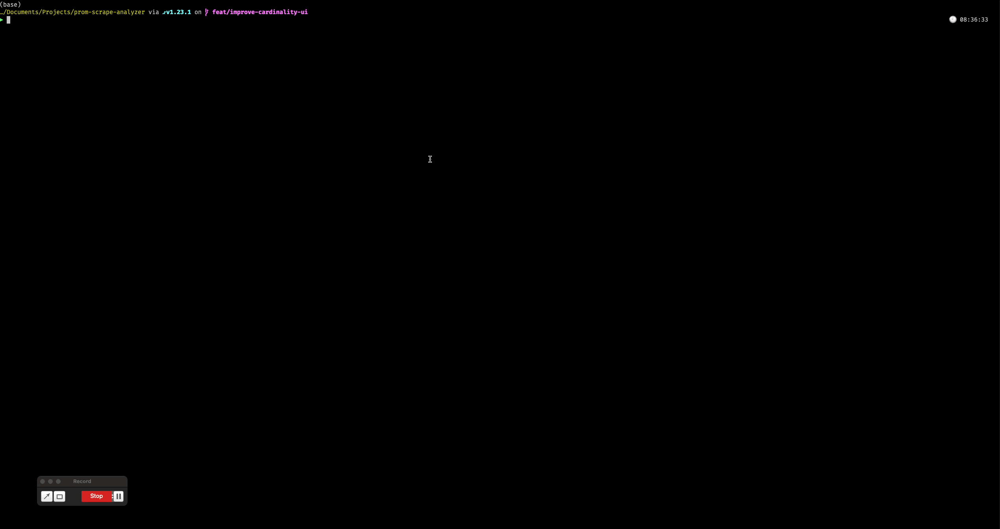

# Prom Scrape Analyzer

Prom Scrape Analyzer is a powerful companion tool for Observability professionals,
designed to inspect Prometheus scrape endpoints and provide valuable insights into your monitoring setup.

## Motivation

This project was born out of two main desires:

1. **Endpoint Visibility**: Working in the Observability space, I was frustrated by the lack of tools to easily view metrics
being exported in Prometheus' protobuf endpoints. This tool aims to bridge that gap, providing clear visibility into the
actual metrics being scraped.

2. **Exploring Bubble Tea TUI library**: I wanted to experiment with and showcase the capabilities of Bubble Tea,
a powerful library for building Text User Interface (TUI) applications. This project serves as a playground
for creating an intuitive and interactive command-line interface.

## Features

- [x] Scrape and analyze cardinality for a given Prometheus scrape endpoint (supports Protobuf format)
- [x] Support for latest features like Created Timestamps and Native Histograms, showing them as separate columns.

## Planned Features
- [ ] Allow to select a specific metric to inspect, and show its series.
- [ ] Improve TUI with filtering, sorting and other features.
- [ ] Watch mode, to see how cardinality and churn evolve over time.
- [ ] For native histograms, show the bucket boundaries and counts (if possible, chart it).

## Getting Started

This project is currently under development. Stay tuned for updates and installation instructions.

## Contributing

We welcome contributions! Please check back soon for guidelines on how to contribute to this project.

## License

[MIT](LICENSE)
